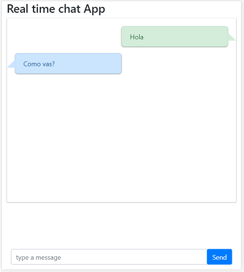

# Aplicaciones en tiempo real 

_Estas nos permiten transmitir informacion casi de inmediato entre aplicaciones, en este ejemplo veremos la utilizacion de **Sockets** como canal de comunicacion especificamente el uso de **socket.io** tanto para el cliente como para el servidor para la creacion de un chat en tiempo real._

## Requerimientos
 1. _**Navegador Web**, si esta leyendo esto lo mas probable es que ya tengas uno :)_
 2. _**Node js**, debes tener instalado tu node js para poder instalar paquetes y ejecutar scripts_
 3. _**Editor de Texto**, cualquier editor de texto sirve, si hasta bloc de notas._
 4. _**Conexion a Internet**, no esta demas , pues lo necesitamos para instalar nuestras dependencias_

## Hola Mundo
_Este respositorio tiene 2 subdirectorios, uno es el directorio **server** el cual contiene el archivo **server.js** que posee la logica para recibir y emitir mensajes de todos los clientes conectados al **socket** por otra parte tenemos el directorio **client** el cual tiene 3 archivos **index.html**(maquetacion del chat), **style.css**(capa de estilos para que nuestro chat se vea bien ) y **chat.js** el cual contiene la logica para enviar y recibir mensajes desde el server_

## Dependencias Server 
_Como vemos a continuacion en el package.json este solo tiene una dependencia, la cual es socket.io_
_Si quieres saber un poco mas sobre  **socket.io** ves al [Sitio Oficial](https://socket.io/ "Socket IO") o en [npm socket.io](https://www.npmjs.com/package/socket.io "Socket IO")_
```
--package.json
{
  ...
  "dependencies": {
    "socket.io": "^2.3.0"
  }
}
```
_Como nuestro package ya tiene este paquete en las depencias solo nos ubicamos en nuestro directorio server abrimos una consola, y ejecutamos npm install_
```
$ npm install
```
si no tenemos la dependencia socket.io en el package.json ejecutamos
```
$ npm install socket.io
```
## Run Server 
_Para ejecutar nuestro server ejecutamos con el comando node server.js_
```
$ node server.js
```
_Si todo salio bien la consola te arroja la siguiente salida_
```
Esperando Clientes on ...
```

## Dependencias Client
_Al igual que el server este utiliza la libreria **socket.io** pero en el cliente no la vamos a instalar como dependencia, si no que vamos a agregarla a nuestra pagina html como un script mas , para eso  vamos al siguiente enlace
https://socket.io/blog/ y seleccionamos la ultima version estable en CDN (red de distribucion de contenidos), veremos algo como esto_
```
<script src="https://cdnjs.cloudflare.com/ajax/libs/socket.io/2.0.3/socket.io.js"></script>

```
_El cual vamos a agregar en nuestro index.html antes del cierre de la etiqueta body._
_Para este ejemplo se agregaron los scripts de jquery y bootstrap los cuales tambien se agregaron por cdn desde las paginas oficiales._

```<!DOCTYPE html>
<html lang="en">
<head>
    <meta charset="UTF-8">
    <meta name="viewport" content="width=device-width, initial-scale=1.0">
    <link rel="stylesheet" href="https://stackpath.bootstrapcdn.com/bootstrap/4.4.1/css/bootstrap.min.css">
    <link rel="stylesheet" href="style.css">
    <title>Hello World</title>
</head>
<body>
   .......
   Mi Contenido de pagina
   ......
    <script  src="https://code.jquery.com/jquery-3.4.1.min.js"  integrity="sha256-CSXorXvZcTkaix6Yvo6HppcZGetbYMGWSFlBw8HfCJo="  crossorigin="anonymous"></script>
    <script src="https://stackpath.bootstrapcdn.com/bootstrap/4.4.1/js/bootstrap.min.js"></script>
    <script src="https://stackpath.bootstrapcdn.com/bootstrap/4.4.1/js/bootstrap.bundle.min.js"></script>
    <script src="https://cdnjs.cloudflare.com/ajax/libs/socket.io/1.4.5/socket.io.min.js"></script>
    <script src="./chat.js"></script>

</body>
</html>
```

## Run Server 
_Para ejecutar el cliente solo elegimos nuestro navegador de confianza y abrimos el archivo index.html_



